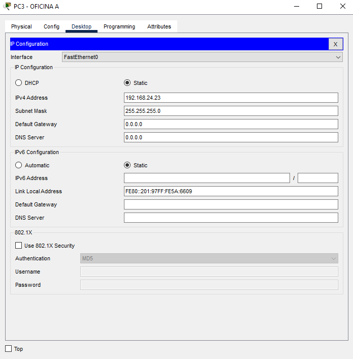

# Manual Tecnico
## Jonatan Leonel Garcia Arana
# Objetivos 
- Proporcionar una descripción completa de la topología de la red diseñada para el pequeño negocio de dos niveles, incluyendo la disposición de los equipos, la configuración de los switches, y la estructura de la red en estrella.
- Detallar la configuración de las máquinas virtuales VPC y switches de capa 2, así como la implementación de los protocolos Ethernet, IP, ARP e ICMP en la red diseñada.
- Proporcionar una guía detallada y paso a paso sobre cómo recrear la topología de red en Packet Tracer, incluyendo la configuración de dispositivos, la asignación de direcciones IP, y la interconexión de equipos.
#
# Requerimientos minimos
#
Cisco Packet Tracer 8.2 (64 bits):
- Computadora con uno de los siguientes sistemas operativos: Microsoft Windows 8.1, 10, 11 (64 bits), Ubuntu 20.04, 22.04 LTS (64 bits) o macOS 10.14 o posterior.
- CPU amd64 (x86-64)
- 4 GB de RAM libre
- 1,4 GB de espacio en disco libre
#
Cisco Packet Tracer 8.2 (32 bits):
- Computadora con uno de los siguientes sistemas operativos: Microsoft Windows 8.1, 10 (32 bits)
- CPU x86 compatible
- 2 GB de RAM libre
- 1,4 GB de espacio en disco libre
#
# Configuracion de las VPCs
#
Area de trabajo de la Oficina A y Configuracion IP
 

#
Area de trabajo de la Oficina B y Configuracion IP
 

#
Area de trabajo de la Oficina C y Configuracion IP
 

#
Area de trabajo de Gerencia y Configuracion IP
 

#
Area de trabajo de Administracion y Configuracion IP
 

#
Area de trabajo de Recursos y Configuracion IP
 

#
Area de trabajo de Atencion al Cliente y Configuracion IP
 

#
# COMUNICACION ENTRE AREAS
Comunicacion desde Atencion al cliente a oficina B e IP de la oficina B
 

#
Comunicacion desde Oficina A a recursos humanos e IP de recursos
 

#
Comunicacion desde Gerencia a oficina C e IP de la oficina C
 

# Captura de paquete ARP
ip a donde mandamos el paquete
 

 

 

#

# Conclusion
La realización de esta práctica nos permitio demostrar la capacidad para diseñar y configurar una red local pequeña utilizando la herramienta Packet Tracer. Al finalizar la práctica, hemos adquirido experiencia en la creación de topologías de red en estrella, la configuración de switches, la asignación de direcciones IP y la realización de capturas de paquetes para verificar la conectividad entre los dispositivos.

