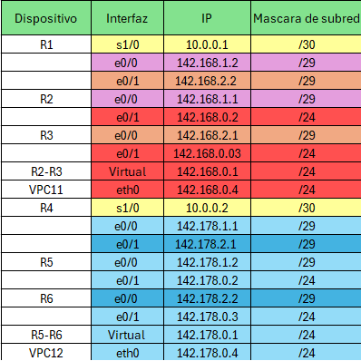

# Manual Tecnico 
### Jonatan Leonel Garcia Arana - 202000424

### Tabla Interfaces
 

 

##### ver switches mode
- show etherchannel summary

##### ver HSRP 
- do sh standby

### configurar LACP 
- enable
- configure terminal
- interface range fa0/1-2 (rango que tenemos)
- channel-group 1 mode active (asignar grupo)
- exit
- interface port-channel 1 (grupo que creamos)
- switchport mode trunk
- end 
- write

### configurar PAGP swithces
- enable 
- configure terminal
- interface range fa0/1-2 (rango que tenemos)
- channel-group 1 mode desirable(asignar grupo)
exit
- interface port-channel 2 (grupo que creamos)
- switchport mode trunk
- end
- write

### CONFIGURAR ROUTER 1 int0/0
- enable
- configure terminal
- interface fa0/0
- ip address 142.168.1.2 255.255.255.248    /subred 29
- no shutdown
- do wr

### CONFIGURAR ROUTER1 int0/1
- enable
- configure terminal
- interface fa0/1
- ip address 142.168.2.2 255.255.255.248    /subred 29
- no shutdown
- do wr

### CONFIGURAR ROUTER 1 COMUNICACION SERIAL
- enable
- configure terminal
- int s1/0
- ip address 10.0.0.1 255.255.255.252
- no shutdown 
- do wr
- exit

### CONFIGURAR ROUTER2 int0/0
- enable
- configure terminal
- interface fa0/0
- ip address 142.168.1.1 255.255.255.248    /subred 29
- no shutdown
- do wr

### configurar HSRP ROUTER 2 e0/1

- enable
- configure terminal
- hostaname R2
- interface f0/1
- ip address 142.168.0.2 255.255.255.0
- standby 10 ip 142.168.0.1
- no shutdown 
- do wr
- exit

### CONFIGURAR ROUTER 3 int0/0
- enable
- configure terminal
- interface fa0/0
- ip address 142.168.2.1 255.255.255.248
- no shutdown
- do wr

###  configurar HSRP ROUTER 3 E0/1

- enable
- configure terminal
- hostaname R3
- interface f0/1
- ip address 142.168.0.3 255.255.255.0
- standby 10 ip 142.168.0.1
- standby 10 priority 150
- standby 10 preempt 
- no shutdown 
- do wr

### CONFIGURAR ROUTER 4 int0/0
- enable
- configure terminal
- interface fa0/0
- ip address 142.178.1.1 255.255.255.248    /subred 29
- no shutdown
- do wr

### CONFIGURAR ROUTER 4 int0/1
- enable
- configure terminal
- interface fa0/1
- ip address 142.178.2.1 255.255.255.248    /subred 29
- no shutdown
- do wr

### CONFIGURAR ROUTER 4 COMUNICACION SERIAL
- enable
- configure terminal
- int s1/0
- ip address 10.0.0.2 255.255.255.252
- no shutdown 
- do wr
- exit

### CONFIGURAR ROUTER 5 int0/0
- enable
- configure terminal
- interface fa0/0
- ip address 142.178.1.2 255.255.255.248    /subred 29
- no shutdown
- do wr

### CONFIGURAR ROUTER 5 int0/1
- enable 
- configure terminal
- hostname R5
- interface fa0/1
- ip address 142.178.0.2 255.255.255.0
- standby 10 ip 142.178.0.1
- standby 10 priority 150
- standby 10 preempt
- no shutdown
- do wr

### CONFIGURAR ROUTER 6 int0/0
- enable
- configure terminal
- interface fa0/0
- ip address 142.178.2.2 255.255.255.248    /subred 29
- no shutdown
- do wr

### configurar HSRP ROUTER 6 int0/1
- enable
- configure terminal
- interface f0/1
- ip address 142.178.0.3 255.255.255.0
- standby 10 ip 142.178.0.1
- no shutdown 
- do wr

### Rutas estaticas Router 1
- ip route 142.168.0.0 255.255.255.0 142.168.1.1 
- ip route 142.168.0.0 255.255.255.0 142.168.2.1 
- ip route 142.178.0.0 255.255.255.0 10.0.0.2 
- ip route 10.0.0.0 255.255.255.252 10.0.0.2 
- ip route 142.178.1.0 255.255.255.248 10.0.0.2 
- ip route 142.178.2.0 255.255.255.248 10.0.0.2 
- ip route 142.178.3.0 255.255.255.248 10.0.0.2
### Rutas estaticas Router 2
- ip route 10.0.0.0 255.255.255.252 142.168.1.2 
- ip route 142.178.0.0 255.255.255.0 142.168.1.2 
- ip route 142.168.2.0 255.255.255.0 142.168.1.2 
- ip route 142.178.1.0 255.255.255.0 142.168.1.2 
- ip route 142.178.2.0 255.255.255.0 142.168.1.2 

### Rutas estaticas Router 3
- ip route 10.0.0.0 255.255.255.252 142.168.2.2 
- ip route 142.178.0.0 255.255.255.0 142.168.2.2 
- ip route 142.168.2.0 255.255.255.0 142.168.2.2 
- ip route 142.178.1.0 255.255.255.248 142.168.2.2 
- ip route 142.178.2.0 255.255.255.248 142.168.2.2 

### Rutas estaticas Router 4
- ip route 142.168.0.0 255.255.255.0 10.0.0.1 
- ip route 142.178.0.0 255.255.255.0 142.178.1.2 
- ip route 142.178.0.0 255.255.255.0 142.178.2.2 
- ip route 10.0.0.0 255.255.255.252 10.0.0.1 
- ip route 142.168.1.0 255.255.255.248 10.0.0.1 
- ip route 142.168.2.0 255.255.255.248 10.0.0.1 
- ip route 142.168.0.0 255.255.255.248 10.0.0.1 

### Rutas estaticas Router 5
- ip route 142.168.0.0 255.255.255.0 142.178.1.1 
- ip route 142.168.1.0 255.255.255.248 142.178.1.1 
- ip route 142.168.2.0 255.255.255.248 142.178.1.1 
- ip route 10.0.0.0 255.255.255.252 142.178.1.1 

### Rutas estaticas Router 6
- ip route 142.168.0.0 255.255.255.0 142.178.2.1 
- ip route 142.168.1.0 255.255.255.248 142.178.2.1 
- ip route 142.168.2.0 255.255.255.248 142.178.2.1 
- ip route 10.0.0.0 255.255.255.252 142.178.2.1

### verificaciones de conexiones
- ping 142.178.0.4
- ping 142.168.0.4